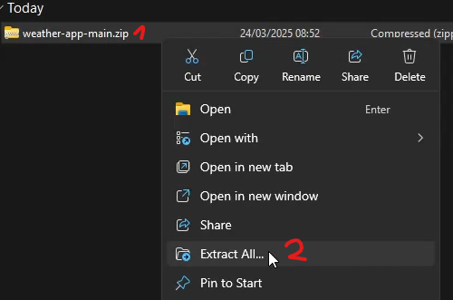
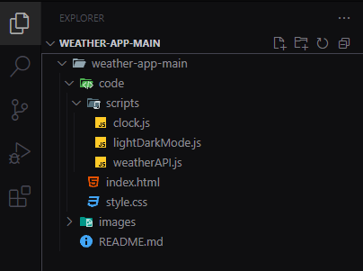

# Weather App

Diese Webapp zeigt dir das aktuelle Wetter für deinen Standort oder eine ausgewählte Stadt. Du kannst zwischen 12- und 24-Stunden-Anzeige wählen, den Dunkel- oder Hellmodus nutzen und zwischen Celsius und Fahrenheit umschalten.

> [!WARNING]
> Die Wetterdaten sind nicht immer ganz genau. Dies liegt an fehlenden Daten der API.

## Inhaltsverzeichnis

1. [GitHub Pages](#github-pages)
2. [Lokale Installation](#lokale-installation)\
   2.1 [Repo herunterladen und extrahieren](#1-github-repo-heruterladen-und-extrahieren)\
   2.2a [Im Ordnerverzeichnis öffnen](#2a-projekt-im-ordnerverzeichnis-öffnen)\
   2.2b [In VSCode öffnen](#2b-projekt-in-vscode-öffnen)
3. [API](#api)\
   3.1 [API-Key erhalten](#api-key-erhalten)
4. [Autor](#autor)

## GitHub Pages

Bis am 1. April wird dieses Projekt auf [GitHub Pages](https://radblts.github.io/weather-app/code/) zugänglich sein.

## Lokale Installation

**Was du brauchst:**

- Browser mit Zugriff auf das Internet und den Standort

**Optional:**

- VSCode (v1.98.1)
- Live Server extension für VSCode von Ritwick Dey (v5.7.9)

## 1. [GitHub Repo](https://github.com/radblts/weather-app) heruterladen und extrahieren

1.1 Oben rechts auf `Code` drücken\
1.2 Tab `Local`selektieren\
1.3 `Download ZIP` auswählen

1.4 Speicherort öffnen z.B. `Downloads`\
1.5 ZIP-Ordner selektieren und rechte Maustaste drücken\
1.6 `Extract All` auswählen

> [!NOTE]
> Das Projekt kann nun direkt vom Ordnerverzeichnis ([Schritt 2a](#2a-projekt-im-ordnerverzeichnis-öffnen) oder auch in VSCode ([Schritt 2b](#2b-projekt-in-vscode-öffnen)) geöffnet werden. Falls du Bearbeitungen vornehmen wills, solltest du VSCode verwenden.

## 2a. Projekt im Ordnerverzeichnis öffnen

2a.1 Der extrahierte Ordner öffnen\
2a.2 Den `weather-app-main` öffnen\
2a.3 Den `Code`-Ordner ebenfalls öffnen

Der Pfad sollte dann so aussehen: `[Speicherort]\weather-app-main\weather-app-main\code`

2a.4 `index.html` mit einem Doppelklick öffnen

> [!NOTE]
> Alternativ kann man auch das `index.html` auswählen und mit einem Rechtsklick und `Open` / `Open with` das Projekt in einem Browser öffnen.

Nun sollte das Projekt in einem Browser (z.B. `Microsoft Edge`, `Firefox` oder `Chrome`) geöffnet sein.

> [!CAUTION]
> Der API-Key wird am 1. April gelöscht. Daher muss er im Code ersetzt werden, um die Funktionalität beizubehalten. Dies ist unter `code/scripts/weatherAPI` - `line 1` zu finden.

## 2b. Projekt in VSCode öffnen

2b.1 VSCode öffnen\
2b.2 Der extrahierte Ordner mit drag-and-drop in  das Programm ziehen 

> [!NOTE]
> Alternativ kann man den Ordner auch über `File -> Open Folder -> [pathToFolder]` öffnen.

Somit sollte man diese Ordnerstruktur auf der linken Seite in VSCode sehen:

2b.3 Man kann nun mit der Extension`Live Server` den Server unten rechts in VSCode starten.

Nun sollte das Projekt in einem Browser (z.B. `Microsoft Edge`, `Firefox` oder `Chrome`) geöffnet sein.

> [!CAUTION]
> Der API-Key wird am 1. April gelöscht. Daher muss er im Code ersetzt werden, um die Funktionalität beizubehalten. Dies ist unter `code/scripts/weatherAPI` - `line 1` zu finden.

## API

Dieses Projekt verwended die [WeatherAPI](https://www.weatherapi.com) mit dem Free Plan. 

### API-Key erhalten

Um einen API-Key zu erhalten muss man erstmals ein Konto bei WeatherAPI haben. Im anschluss ist der Key auf dem Profil zu finden.

> [!NOTE]
> Um mehr Details zu erhalten können Sie sich die [WeatherAPI Docs](https://www.weatherapi.com/docs/) anschauen.

## Autor

**Neva Roten**

- GitHub: [radblts](https://github.com/radblts)
- E-Mail: neva.roten@edu.vs.ch

Dieses Projekt wurde mit **HTML, CSS, JavaScript und der WeatherAPI** erstellt, um aktuelle Wetterdaten bereitzustellen.